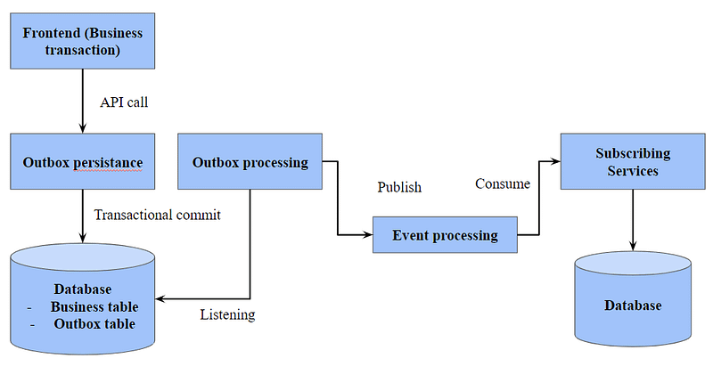

# What is it?

This is demo example of design pattern "Transactional outbox".



Basically, in this project we have few modules.

First of all "common", which contains common parts of the project.

Then "orders-service", which contains API for operations with orders.

To create new order you could use next cURL request:

```
curl --request POST \
  --url http://localhost:8080/orders \
  --header 'Content-Type: application/json' \
  --data '{
	"products": [1, 2]
}'
```

Thirdly, there is "outbox-consumer", this app constantly read from "outbox table" and send updates to message broker (in our case Kafka).

Finally, "warehouse-service" listens to new messages from Kafka.

# How to run

`$ make libs` - to package apps.

`$ docker-compose up` - to run postgresql and kafka/zookeeper in docker.

`$ java -Dspring.profiles.active=dev -jar <your-application>.jar` - to run spring boot application.